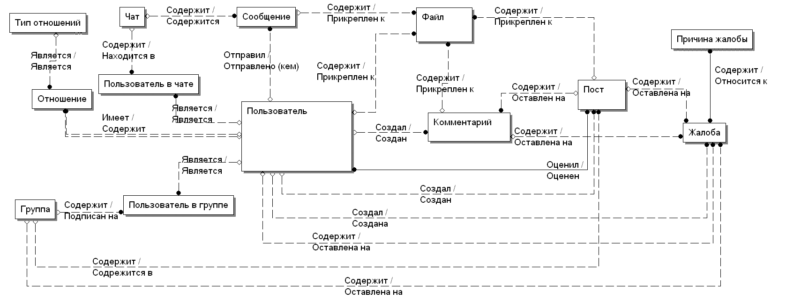

## Содержание

- [Инструкция по запуску](#инструкция-по-запуску)
- [Описание проекта](#описание-проекта)
  - [Базовая функциональнось](#базовая-функциональность-)
  - [Рассылка почты](#рассылка-почты)
  - [RabbitMQ](#rabbitmq)
  - [Redis](#redis)
  - [SignalR](#signalr)
- [Структура проекта](#структура-проекта)
- [Логическая модель данных](#логическая-модель-данных-idef1x)

## Инструкция по запуску
<p>Рекомендуется запускать с помощью docker-compose.</p>
<p>В директории проекта:</p>

``docker-compose up --build``
___
## Описание проекта
Социальная сеть - аналог VK/Facebook.
### Базовая функциональность: 

- Возможность зарегистрировать аккаунт. :heavy_check_mark:
- На личной странице пользователь может вести личный блог, выкладывать записи. :heavy_check_mark:
- Есть возможность добавления пользователей в друзья. :heavy_check_mark:
- Пользователь может создать в группу, в которой также есть возможность выкладывать записи. :heavy_check_mark:
- Под записями можно оставлять комментарии.  :heavy_check_mark:
- Записи можно лайкать. :heavy_check_mark:
- Есть несколько ролей:  :heavy_check_mark:
  - Обычный пользователь
  - Администратор
  - Администратор с неограниченными правами
- Можно оставить жалобу на пользователя/комментарий/запись/группу, жалобы должен рассматривать администратор. :x:
- Реализован встроенный мессенджер, есть возможность создать диалог/групповой чат. :x:
- К постам/сообщениям/комментариям можно прикладывать картинки. :heavy_check_mark:
- Пользователь может поставить аватар. :heavy_check_mark:
- Возможность восстановить пароль. :x:
- Возможность посмотреть глобальную ленту, с сортировкой по популярности (за день/неделю и тд). :x:

### Рассылка почты

- При регистрации приходит сообщение, в котором необходимо подтвердить регистрацию. :heavy_check_mark:
- При отправке жалобы приходит сообщение, об обработке жалобы. :x:
- При бане/удалении аккаунта/поста и тд, приходит сообщение с предупреждением. :x:
- При восстановлении пароля, письмо с подтверждением. :x:

### RabbitMQ

Для уменьшения нагрузки на систему, с помощью брокера очередей реализована следующая функциональность:
- Отправка жалоб. :x:
- Рассылка о регистрации. :heavy_check_mark:
- Запросы на дружбу. :x:
- Лайки. :x:
- Различные уведомления: о лайках, новых комментариях, постах в группах и тд. :x:

### Redis

В качестве системы для кэширования используется Redis. Кэшируется следующая информация: 
- Личная страница пользователя. :heavy_check_mark:
- Список друзей. :heavy_check_mark:
- Профили друзей. :heavy_check_mark:
- Список последних уведомлений. :x:
- Список групп на которые подписан пользователь. :heavy_check_mark:
- Список последних постов в группах. :x:
- Топ самых популярных записей. :x:

### SignalR

- Мессенджер. :heavy_check_mark:
- Уведомления.  :x:
- Статус пользователя (онлай/офлайн) :x:
- Добавление комментариев :x:

### Структура проекта
```
└── src                                                  
    ├── Data                                    # слой работы с данными
    │   ├── SocialNetwork.Context               # описание dbContext
    │   ├── SocialNetwork.Entities              # описание всех сущностей
    │   └── SocialNetwork.Repository            # реализация Repository паттерна
    ├── Services                                # слой бизнес логики
    │   ├── SocialNetwork.AccountServices       # сервис для работы с аккаунтами, личным профилем, админами
    │   ├── SocialNetwork.AttachmentServices    # сервис для работы с вложениями
    │   ├── SocialNetwork.EmailServices         # отправка Email
    │   ├── SocialNetwork.GroupServices         # сервис для работы с группами
    │   ├── SocialNetwork.PostServices          # сервис для работы с постами
    │   └── SocialNetwork.RelationshipServices  # сервис для работы с друзьями
    ├── Shared                                  # общий слой, доступен отовсюду
    │   ├── SocialNetwork.Common                # различные классы расширения, хелперы, енамы
    │   ├── SocialNetwork.Constants             # строковые константы
    │   └── SocialNetwork.Settings              # общие настройки приложения, получение переменных окружения
    └── Systems                                 
        ├── SocialNetwork.IdentityServer        # сервис для генерации JWT 
        └── SocialNetwork.WebAPI                # основное веб-апи
```
### Логическая модель данных IDEF1X

____
